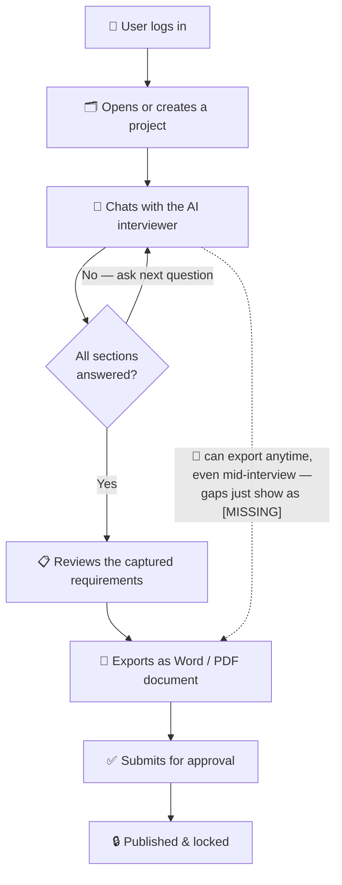

<div align="center">

# 🤖 BA-Bot — AI Business Analyst Agent

**Automate your requirements discovery. Talk to an AI. Export a polished FDR document.**

[](https://python.org)
[](https://fastapi.tiangolo.com)
[](https://reactjs.org)
[](https://typescriptlang.org)
[](https://vitejs.dev)
[](https://sqlite.org)

</div>

---

## 📌 What is BA-Bot?

BA-Bot is a full-stack AI-powered tool built for **Business Analysts, Product Managers, and Project Leads** at L&T PES.

Instead of spending hours in manual requirement-gathering workshops, you simply **have a conversation** with an AI agent. It asks the right questions one at a time, tracks what's still missing, extracts structured data as you talk, and — when the interview is complete — compiles everything into a polished Requirements Discovery document.

> 💡 **The core idea:** Replace hours of manual elicitation sessions with a smart conversational AI that extracts, structures, and exports your requirements in minutes — with multi-user roles, team-based access, an approval workflow, and an admin control panel on top.

---

## ✨ Features

### 🗂️ Multi-Project Dashboard
Manage multiple active projects from a single interface, each showing real-time completion progress, department, sponsor, and status.

### 🔐 Role-Based Access
System-wide roles (Super Admin, Admin, Business Analyst, Project Manager, Reviewer, Viewer) combined with per-project roles (Project Manager, Business Analyst, Contributor, Viewer) and team-based inherited access — a user can reach a project via direct ownership, an explicit invite, or membership on a team assigned to that project.

### 💬 AI Interview Workspace
A chat interface driven by a **Forjinn AI flow** (LLM backend), streamed token-by-token in real time over **Server-Sent Events (SSE)**. The AI asks one structured question at a time, guided by a deterministic gap-analysis engine that tracks which topic (project info, stakeholders, functional requirements, constraints, etc.) still needs answers.

### 🧠 Structured State Extraction
As the interview progresses, every turn triggers a second, silent AI call that extracts *only what changed* into a structured JSON state — no manual form-filling, no copy-pasting.

### ✅ Approval Workflow
Projects move through `DRAFT → PENDING_REVIEW → APPROVED → PUBLISHED`. A Reviewer/Admin approves or rejects; once published, a project is locked from further edits.

### 📋 Requirements Review Panel
Review all captured data before finalizing, with live progress indicators across every tracked discovery section.

### 📄 One-Click Document Export
Generate a **Final Discovery Requirements (FDR)** document with one click:
- **DOCX** — a fixed, template-matching Word document (python-docx), with any never-discussed field rendered as `[MISSING]` so gaps are obvious.
- **PDF** — the AI writes a full polished document in Markdown, rendered to PDF (ReportLab) with custom typography.

### 🛠️ Admin Control Panel
User management, team management, audit logs, system settings (including the AI's base system prompt and self-registration toggle), a role/permission matrix editor, and per-team analytics — all under `/api/admin/*`.

### 📊 Analytics Dashboard
Tracks total users/projects, AI token usage and estimated cost, a 7-day activity chart, and department breakdowns.

---

## 🏗️ Architecture



**In plain terms:** you log in, open a project, and just talk to the AI — it keeps asking questions until every section (stakeholders, requirements, constraints, etc.) is covered. Once done, you review what it captured, export it as a document, and send it through approval before it's published. **Exporting isn't gated on completion** — the dotted line shows you can generate a document at any point in the conversation, and whatever hasn't been discussed yet just shows up as `[MISSING]` instead of blocking the export.

Behind the scenes, every chat message is permission-checked, sent to the AI together with a summary of what's already been discussed, and the AI's reply is scanned to update the project's data automatically. A more technical breakdown of that pipeline (prompts, retries, state extraction) lives in [`docs/architecture.md`](docs/architecture.md).

---

## 🛠️ Tech Stack

### What's actually used

| Layer | Technology | Version | Purpose |
|---|---|---|---|
| **Frontend framework** | React | 19.2 | SPA UI, no server-side rendering |
| **Frontend language** | TypeScript | 6.x | Type safety across `.tsx` components |
| **Build tool** | Vite | 8.x | Dev server (HMR) + production bundling |
| **Linting** | ESLint (flat config) | 10.x | `eslint.config.js`, incl. `react-hooks`/`react-refresh` plugins |
| **Styling** | Vanilla CSS | — | Hand-written design system (`App.css`, `index.css`, `Admin.css`) |
| **Math rendering** | KaTeX | 0.17 | Renders equations inside chat messages |
| **HTTP client (frontend)** | Browser `fetch` + manual SSE parsing | — | No HTTP client library added |
| **Backend framework** | FastAPI | 0.115 | Async REST API |
| **ASGI server** | Uvicorn | 0.30 | Runs the FastAPI app, with `reload=True` outside production |
| **ORM** | SQLAlchemy | 2.0 | Declarative models + session management |
| **Database** | SQLite | 3 | Single-file DB (`ba_bot.db`), path overridable via `DATABASE_URL` |
| **Auth** | PyJWT + bcrypt | 2.9 / 4.2 | Stateless JWT sessions (24h expiry), bcrypt password hashing |
| **DOCX generation** | python-docx | 1.1.2 | Structured Requirement Discovery Form output |
| **PDF generation** | ReportLab | 4.2.5 | Freeform AI-authored document rendering |
| **Outbound HTTP** | `requests` + `urllib3` | 2.32 / 2.2 | Calls to the Forjinn prediction API, with manual retry/backoff |
| **Config** | `python-dotenv` | 1.0.1 | Loads `.env` into `os.environ` |
| **Streaming transport** | Server-Sent Events (SSE) | — | One-way token streaming from LLM → browser |
| **AI backend** | Forjinn Flow (external) | — | Hosted LLM chatflow accessed over plain HTTP, not a vendor SDK |
| **Containerization** | Docker + Docker Compose | — | `backend/Dockerfile`, `frontend/Dockerfile` (Nginx-served build), `docker-compose.yml` |
| **Web server (prod frontend)** | Nginx | — | Serves the compiled Vite build inside the frontend container |

### What's deliberately *not* used (and why it's worth knowing)

| Not used | What's used instead | Notes |
|---|---|---|
| **React Router** (or any routing library) | Manual view-state switching inside `App.tsx` | The whole SPA is effectively one component tree with internal state, not URL-based routing. |
| **Redux / Zustand / MobX / Context-based global store** | Local component state / prop drilling | No state-management library in `package.json` — confirmed by dependency list. |
| **Tailwind / Material UI / Chakra / any CSS framework** | Hand-written vanilla CSS | Fully custom design system, no utility-class framework. |
| **Axios (or any HTTP client library)** | Native `fetch` | No HTTP client dependency beyond the browser built-in. |
| **WebSockets** | Server-Sent Events (SSE) | Streaming is one-directional (server → client), which is all SSE needs — no bidirectional socket layer. |
| **GraphQL** | Plain REST (`/api/...` JSON endpoints) | No schema/resolver layer. |
| **Alembic (or any migration framework)** | Hand-rolled `utils/migrate.py` | Runs `ALTER TABLE` statements guarded by try/except at every startup — no versioned migration history. |
| **PostgreSQL / MySQL** | SQLite | `DATABASE_URL` env var *could* point elsewhere, but nothing in the code assumes a non-SQLite dialect (the migration script uses raw `sqlite3` calls directly). |
| **Redis / Memcached (caching layer)** | None | Every request hits the DB directly; no cache invalidation logic exists. |
| **Celery / RQ / any task queue** | In-process background work via FastAPI's request lifecycle | The post-chat state update runs inside the same streaming generator function using a second DB session — not a separate worker process. |
| **OpenAI SDK / LangChain / any LLM SDK** | Raw `requests` calls to a Forjinn REST endpoint | The LLM integration is a plain HTTP POST with a `question`/`streaming` JSON body — no abstraction layer, no prompt-template framework. |
| **pytest / Jest / any automated test suite** | A manual smoke-test script (`backend/e2e_tester.py`) | It's a standalone script you run by hand against a live server — not wired into `pytest`, not run in CI. |
| **CI/CD pipeline** | None found | No `.github/workflows/` directory — builds/deploys are manual (`docker compose up --build`). |
| **Kubernetes / orchestration platform** | Docker Compose only | Single-host container orchestration; no Helm charts, no k8s manifests. |
| **Rate limiting / API gateway** | None | No `slowapi`, no reverse-proxy rate limiting configured in the provided Nginx config. |
| **Server-side rendering (Next.js, etc.)** | Client-side-only Vite SPA | The frontend is a static build served by Nginx; no Node server runs at request time. |

---

## 📂 Project Structure

```
ba-agent/
├── backend/
│   ├── app.py                    # FastAPI app: middleware, /api/predict, health, mock LLM
│   ├── database.py               # SQLAlchemy engine/session/Base
│   ├── auth/
│   │   ├── jwt.py                # Password hashing, JWT encode/decode
│   │   └── routes.py             # /api/auth/register, /login, /logout, /me
│   ├── dependencies/
│   │   └── auth.py               # get_current_user, require_role, require_project_access, require_project_owner
│   ├── models/
│   │   ├── models.py             # All SQLAlchemy tables
│   │   └── __init__.py
│   ├── routes/
│   │   ├── projects.py           # /api/projects/* — CRUD, export, workflow, invites
│   │   └── admin.py              # /api/admin/* — users, teams, settings, analytics, discovery sections
│   ├── services/
│   │   ├── audit.py              # AuditLog writer
│   │   ├── rbac_service.py       # Role → permission matrix (role_permissions.json)
│   │   ├── conversation_manager.py   # Save/fetch chat messages
│   │   ├── summary_manager.py    # Rolling AI summarization
│   │   ├── gap_analyzer.py       # Deterministic "what's missing" logic
│   │   ├── project_state_manager.py  # Structured requirements state engine
│   │   ├── prompt_builder.py     # Assembles the per-turn LLM prompt
│   │   └── fdr_summary.py        # Transcript → FDR JSON for export
│   ├── utils/
│   │   ├── prod_ready.py         # Retry/backoff, startup validation, global error handlers
│   │   ├── migrate.py            # Startup DB schema migration + seeding
│   │   ├── export.py             # Generic Markdown → DOCX/PDF
│   │   └── fdr_docx.py           # Fixed-template FDR Word document builder
│   ├── e2e_tester.py             # Manual smoke-test script (not pytest)
│   └── requirements.txt
│
├── frontend/
│   ├── src/
│   │   ├── App.tsx                # Main SPA: routing state, views, SSE client
│   │   ├── App.css / index.css    # Design system
│   │   ├── config.ts              # Frontend runtime config
│   │   ├── main.tsx                # React DOM mount
│   │   └── admin/                  # Admin portal: Dashboard, UserManagement, TeamManagement,
│   │                                # RolesPermissions, SettingsPanel, AnalyticsPanel, etc.
│   ├── nginx.conf                  # Production static-file serving config
│   ├── index.html
│   ├── vite.config.js
│   └── package.json
│
├── docs/
│   └── architecture.md            # Deep dive: the Project State Engine specifically
│
├── docker-compose.yml
├── docker-compose.offline.yml
├── DOCKER_INSTRUCTIONS.md
└── ba_bot.db                       # Auto-generated SQLite database
```

---

## 🚀 Getting Started

### Prerequisites
- **Node.js** v18+
- **Python** 3.10+
- **pip**

### 1 — Backend

```bash
cd backend
python -m venv venv
source venv/bin/activate          # Windows: venv\Scripts\activate
pip install -r requirements.txt
python app.py
```

| Endpoint | Description |
|---|---|
| `http://127.0.0.1:8000/health` | Health check (DB + AI service reachability) |
| `http://127.0.0.1:8000/docs` | Interactive Swagger UI |

### 2 — Frontend

```bash
cd frontend
npm install
npm run dev
```

Open **`http://localhost:5173`**.

### 3 — Or run everything via Docker

```bash
docker compose up --build -d
```

See [`DOCKER_INSTRUCTIONS.md`](DOCKER_INSTRUCTIONS.md) for environment configuration and volume/persistence details.

---

## 🔌 API Reference

### Auth — `/api/auth`
| Method | Route | Description |
|---|---|---|
| `POST` | `/register` | Create a new user (blocked if self-registration is disabled in settings) |
| `POST` | `/login` | Authenticate, returns a JWT |
| `POST` | `/logout` | Audit-logs the logout (JWT itself isn't server-invalidated) |
| `GET` | `/me` | Current authenticated user |

### Projects — `/api/projects`
| Method | Route | Description |
|---|---|---|
| `GET` | `` | List projects visible to the current user |
| `GET` | `/{id}` | Get a single project |
| `POST` | `` | Create a project |
| `PUT` | `/{id}` | Update a project (or reset its session) |
| `DELETE` | `/{id}` | Delete a project (owner/admin only) |
| `GET` | `/{id}/export?format=docx\|pdf` | Export the requirements document |
| `POST` | `/{id}/submit` | Move to `PENDING_REVIEW` |
| `POST` | `/{id}/review` | Approve/reject (Reviewer/Admin only) |
| `POST` | `/{id}/publish` | Publish + lock (approved projects only) |
| `POST` | `/{id}/invite` | Invite a member with a specific project role |
| `GET` | `/{id}/members` | List project members |

### AI — top-level
| Method | Route | Description |
|---|---|---|
| `POST` | `/api/predict` | Send a chat message, stream the AI's reply via SSE |
| `GET` | `/health` | Health check |
| `*` | `/api/mock-predict` | Local fallback LLM stand-in (used when Forjinn is unreachable) |

### Admin — `/api/admin` (Admin/Super Admin only)
Users, permissions, audit logs, project administration (archive/restore/lock/clone/ownership transfer), conversations, documents, analytics, system settings, teams, and discovery sections. See [`backend/routes/admin.py`](backend/routes/admin.py) for the full list (~50 endpoints).

---

## 🗃️ Data Model (structured state)

Each project's live requirements data is stored as a structured JSON object in `Project.structured_state`, evolved turn-by-turn by the AI as the interview progresses:

```json
{
  "project_name": "...",
  "industry": "...",
  "department": "...",
  "sponsor": "...",
  "business_unit": "...",
  "timeline": "...",
  "budget": "...",
  "business_requirements": [],
  "functional_requirements": [
    { "title": "...", "priority": "High", "confidence": 0.95 }
  ],
  "non_functional_requirements": [],
  "stakeholders": [],
  "constraints": [],
  "assumptions": [],
  "risks": [],
  "integrations": [],
  "user_roles": [],
  "asked_questions": [],
  "completed_sections": [],
  "generated_summaries": "",
  "next_question": ""
}
```

The frontend still consumes an older, flatter JSON shape (`project`/`overview`/`discovery`/`functional_requirements`/`missing_fields`) — `services/project_state_manager.py`'s `get_legacy_payload()` translates between the two on every read, so the frontend didn't need to change when this structured-state engine was added.

---

## ⚠️ Known rough edges

- **`PREDICTION_URL`'s default value is duplicated** across five files (`app.py`, `routes/projects.py`, `services/summary_manager.py`, `services/project_state_manager.py`, `services/fdr_summary.py`) instead of a single shared config constant.
- **The `role_permissions.json` matrix** (editable from Admin → Roles & Permissions) doesn't appear to be checked anywhere in actual route logic — access control is enforced via `require_role`/`require_project_access` instead, so the matrix may currently be informational only.
- **`backend/uploads/`** is created and write-tested at startup but nothing currently writes files into it — provisioned for a file-upload feature that doesn't exist yet.
- **Two "system prompt" layers exist**: one configured inside the Forjinn flow itself, one built in `prompt_builder.py`. The latter's real value is injecting per-turn state Forjinn's static prompt can't know (what's done, what's next) — persona/tone instructions there risk duplicating whatever's already set in Forjinn.
- **No automated tests run in CI** — `e2e_tester.py` must be run manually against a live server.

---

## 📄 License

Internal tool — L&T PES.
